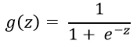
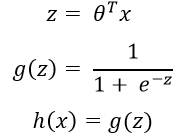
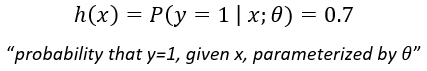
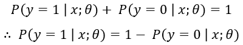
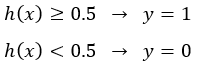
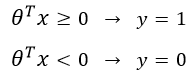

# Logistic Regression

## Table of Contents
- [Description](#description)
- [Prerequisite](#prerequisite)
- [Notations](#notations)
- [Defintion](#definition)
- [Hypothesis Function](#hypothesis-function)
- [Decision Boundary](#decision-boundary)

## Description
A Mathematical intuition and quick guide and understanding of how Logistic Regression Algorithm works. 

## Prerequisite
 - [Standard equation of a Circle](https://www.khanacademy.org/math/algebra2/intro-to-conics-alg2/modal/v/writing-standard-equation-of-circle)
- [Dividing by Zero](https://youtu.be/J2z5uzqxJNU)
- [Logarithm](https://www.khanacademy.org/math/algebra2/exponential-and-logarithmic-functions/introduction-to-logarithms/v/logarithms)
- [Dependent Probability](https://www.khanacademy.org/math/statistics-probability/probability-library/modal/v/analyzing-dependent-probability)

## Notations
- `m` 👉 Number of Training Examples.
- `x` 👉 "input" variable / features.
- `y` 👉 "ouput" variable / "target" variable.
- `n` 👉 Number of feature variable `(x)`
- `(x, y)` 👉 One training example.
- `x`i , `y`i  👉 ith training example.
- `x`ij 👉 ith training example of the jth column / feature.

## Definition
`Logisitic Regression` is a classification algorithm where a dependent variable `'y'` that we want to predict takes on discrete values, for example `y ϵ {0,1}`. It is the most popular and widely used.

 

### Example of Classification Problem
| Subject | Negative | Positive |
| :-----: | :------: | :------: |
| Email | Not-Spam | Spam |
| Online Transaction (Fradulent) | No | Yes |
| Tumor | Benign | Malignant |

 

These are some of the area where `Logistic Regression` is used. Where we want to know whether an email recieved is `'Spam'` or `'Not-Spam'` and then place them to their predicted category. Whether the transaction is fradulent or not and whether the tumor is `'Benign'` or `'Malignant'`.
 
The way we approach to these type of classification problems where the prediction variable `'y'` does not take on continous value, is we set `'y'` to take on `'discrete values'`, for example: 
<pre align = center>y ϵ {0,1}          0 : 'Nagative Class'
                    1 :  'Positive Class' </pre>

 

We can think of predicting value `'y'` taking on two value either `'0'` or `'1'`, either `'Not-Spam'` or `'Spam'`, either `'Benign'` or `'Malignant'` etc.

 

Another name for the class that we denote with `'0'` is the `'negative class'` and another name for the class that we denote with `'1'` is `'positive class'`. So `'0'` we denote as `'Not-Spam'` and `'1'` as `'Spam'`. The assignment of these classes is arbitrary and it doesn't really matter but often there is an intuition that a `'negative class' '0'` is conveying the absence of something.

 

Classification probelms like these are also called `'Binary Classification'` problem where we have only two outputs, either `'0'` or `'1'`.

## Hypothesis Function
We could appraoch the classification problem ignoring the fact that `'y'` is discrete valued, and use [Linear Regression]( https://github.com/JuzerShakir/Linear_Regression#formula-for-univariate-linear-regression) algorithm to try to predict `'y'` given `'x'`. However, it is easy to construct examples where this method performs very poorly. And also it doesn't make sense for our `'h(x)'` to take values larger than `1` or smaller than `0` when we konw `'y ϵ {0,1}'`. To fix this, we need to change the form of our `'h(x)'` to satisfy 0 ≤ h(x) ≤ 1.
 
This is achieved by plugging θTx into the `'Logistic Function'` or also known as `'Sigmoid Function'`.

 

**Sigmoid Function:**

 

 

**Graph of Sigmoid Function:**

 

This function has 2 horizonatal asymptotes. As `'z'` approaches to `-∞` , g(z) approaches to `0` and z approaches to `∞`, g(z) approaches to `1` and `y-intercept` is `0.5` when `'z'` is `0`. 
The function `g(z)` shown above, maps to any real number between `0` and `1` interval, making it useful for tranforming an arbitrary valued function into a fucntion better suited for classification.

 

Now lets set `'z'` to θTx and pass it to our `'h(x)'`:

 

 

`h(x)` will give us the probability that our output is 1. For example, `h(x) = 0.7` gives us the probability of `70%` that our output is `1`. Here's how we interpret it:

 

 

Since here the probability of `'y'` is `0.7` then the probability of `'y'` being `0` is `0.3` since both probability should add up to `1`. 
Here's how we can interpret it:

 

 

### Setting discrete values
We can translate the output of the `h(x)` function as follows: 

 

Because the way that our `Logistic Function g(z)` behaves is that when its input is greater than or equal to `0`, its output is greater than equal to `0.5`.

> **Note:** 
> if z = 0, then e0 = 1, ∴ g(z) = 0.5 
> if z = ∞, then e-∞ = 0, ∴ g(z) = 1 
> if z = -∞, then e∞ = 1, ∴ g(z) = 0 

So if our input to the function `g` is θTx, then that means when θTx ≥ 0, then `h(x)` ≥ 0.5. 
From all of these statements we can now say: 

 

## Decision Boundary
### Linear Decision Boundary

